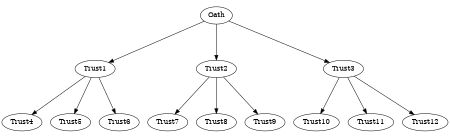

  

---

# Pentakrat

A decentralized platform that materializes the links of trust established in
representational systems.

## Leaders

For **Leaders** the platform provides accurate information about the *level of
support* their proposals build upon their target audiences and the eventual
capability of establishing a *closer relationship* with them, if they so want
to.  Furthermore it paves the way to deploy mechanisms to *fund their
campaigns* and the ideas they stand for.

## Supporters

For **Supporters**, it gives them the *transparency* they deserve when they put
their trust in their representatives. It also provides a mechanism to safely
*second the guiding directions* they align to, and most importantly, it allows
them to *change their support* target whenever they fell their interests are
no longer being well represented.

## Investors

For **Investors**, it is an opportunity to hold an asset that is backed up by
the level of *trust in organizational leadership*. It is a way to *strengthen
electoral processes* by providing the resources they need while preventing
their coercion by selfish agendas. In short, it is a way to *invest with
democratic purpose*.

# Structure

 

# References

- [Crypto Glossary: Cryptocurrencies and Blockchain](https://a16z.com/2019/11/08/crypto-glossary/)
- [An Introduction to Smart Contracts and Their Potential and Inherent Limitations](https://corpgov.law.harvard.edu/2018/05/26/an-introduction-to-smart-contracts-and-their-potential-and-inherent-limitations/)
- [What is a DAO](https://hackernoon.com/what-is-a-dao-c7e84aa1bd69)
- [What happened to the DAO](https://www.coininsider.com/what-happened-to-the-dao/)
- [What is a DAO - Aragon](https://blog.aragon.org/what-is-a-dao/)
- [15 Ways the World is Being Changed by DAOs](https://blog.aragon.org/15-ways-the-world-is-being-transformed-by-daos)
- [Angel DAO](https://angeldao.org/)
- [Estonia DAO](https://estoniadao.org/)
- [Mirror](https://mirror.xyz/)
- [A few limits of traditional organizations and their governance systems](https://medium.com/@LuigiGrx/2-2-daos-a-new-organizational-and-governance-paradigm-93e889df1b39?p=d452fe6ea41f)
- [Hop Exchange](https://app.hop.exchange/)
