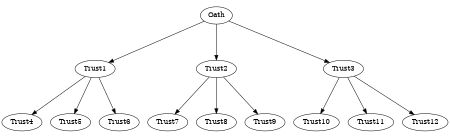

  

---

# Pentakrat

A decentralized platform that materializes the links of trust established in
representational systems.

## Leaders

For **Leaders** the platform provides accurate information about the *level of
support* their proposals build upon their target audiences and the eventual
capability of establishing a *closer relationship* with them, if they so want
to.  Furthermore it paves the way to deploy mechanisms to *fund their
campaigns* and the ideas they stand for.

## Supporters

For **Supporters**, it gives them the *transparency* they deserve when they put
their trust in their representatives. It also provides a mechanism to safely
*second the guiding directions* they align to, and most importantly, it allows
them to *change their support* target whenever they fell their interests are
no longer being well represented.

## Investors

For **Investors**, it is an opportunity to hold an asset that is backed up by
the level of *trust in organizational leadership*. It is a way to *strengthen
electoral processes* by providing the resources they need while preventing
their coercion by selfish agendas. In short, it is a way to *invest with
democratic purpose*.

# Justification

A great part of our live depends on the decisions that others make on our
behalf, especially regarding common resources administration. One could go
further and say that our fate is determined by those who have climbed the
social pyramid with each of us acting like the steps of a ladder. As social
individuals, we do that because efficient leadership allows us to look for
opportunities beyond the horizon and collectively benefit from them by
following unified and coordinated guidelines. By trusting in individuals who
propose to manage some dimension of our lives for our greatest benefit, we
concede a stake of our autonomy to focus in other areas in which we think we
can make a bigger difference. It is a contract like any other in which one
party commits to provide an orchestration service, in exchange of recognition,
status and economic compensation.

It is intriguing to observe, however, how some of those who have acquired
access to power through their promises, forget about them almost immediately
after realizing they have already claimed the bounty without having to go on a
hunt. Moreover, if they manage to grasp an opportunity to tilt the balance in
their favour, they change the rules of the game by coercing those who are
beneath them and secure their authority. Such acts are vile and deceptive, but
they happen all across the world and especially in those places where
institutions are not strong enough to align the social actors they were
designed to govern. Despite corruption being something that has existed from
the outset of civilization and it is naive to aim at a problem that has
multiple forms and keeps on evolving, perhaps we have achieved a point in which
the technological tools we have developed to aid in our informational,
logistical and commercial activities, can provide the additional utility of
designing a sociological infrastructure that will establish fair and
inalienable rules of the game for all. *Pentakrat* is fond of that vision and
is an initiative to experiment, learn and share the outcomes of those kind of
interventions.

# Structure

 

# References

- [Crypto Glossary: Cryptocurrencies and Blockchain](https://a16z.com/2019/11/08/crypto-glossary/)
- [An Introduction to Smart Contracts and Their Potential and Inherent Limitations](https://corpgov.law.harvard.edu/2018/05/26/an-introduction-to-smart-contracts-and-their-potential-and-inherent-limitations/)
- [What is a DAO](https://hackernoon.com/what-is-a-dao-c7e84aa1bd69)
- [What happened to the DAO](https://www.coininsider.com/what-happened-to-the-dao/)
- [What is a DAO - Aragon](https://blog.aragon.org/what-is-a-dao/)
- [15 Ways the World is Being Changed by DAOs](https://blog.aragon.org/15-ways-the-world-is-being-transformed-by-daos)
- [Angel DAO](https://angeldao.org/)
- [Estonia DAO](https://estoniadao.org/)
- [Mirror](https://mirror.xyz/)
- [A few limits of traditional organizations and their governance systems](https://medium.com/@LuigiGrx/2-2-daos-a-new-organizational-and-governance-paradigm-93e889df1b39?p=d452fe6ea41f)
- [Hop Exchange](https://app.hop.exchange/)
