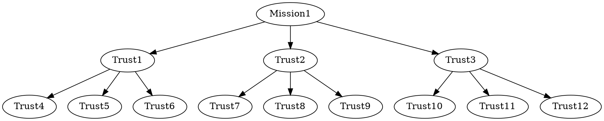
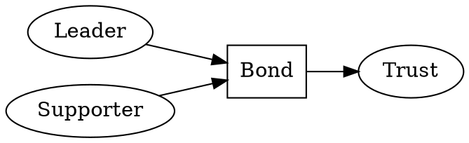

  

---

# Pentakrat

A decentralized platform that materializes the links of trust established in
representational systems.

## Leaders

For **Leaders** the platform provides accurate information about the *level of
support* their proposals build upon their target audiences and the eventual
capability of establishing a *closer relationship* with them, if they so want
to.  Furthermore it paves the way to deploy mechanisms to *fund their
campaigns* and the ideas they stand for.

## Supporters

For **Supporters**, it gives them the *transparency* they deserve when they put
their trust in their representatives. It also provides a mechanism to safely
*second the guiding directions* they align to, and most importantly, it allows
them to *change their support* target whenever they fell their interests are
no longer being well represented.

## Investors

For **Investors**, it is an opportunity to hold an asset that is backed up by
the level of *trust in organizational leadership*. It is a way to *strengthen
electoral processes* by providing the resources they need while preventing
their coercion by selfish agendas. In short, it is a way to *invest with
democratic purpose*.

# Motivation

A great part of our lives depends on the decisions that others make on our
behalf, especially regarding common resources administration. One could go
further and say that our fate is determined by those who have climbed the
political pyramid with each of us acting like the steps of a ladder. As social
individuals, we do that because efficient leadership allows us to look for
opportunities beyond the horizon and collectively benefit from them by
following unified and coordinated guidelines. By trusting in those who propose
to manage some dimension of our lives for our greatest benefit, we concede a
stake of our autonomy to focus in other areas in which we think we can make a
bigger difference. It is a contract like any other in which one party commits
to provide an orchestration service, in exchange of recognition, status and
economic compensation.

It is intriguing to observe, however, how some of those who have acquired
access to power through their promises, forget about them just after realizing
that they have already claimed the bounty without having to go hunting.
Moreover, if they manage to grasp an opportunity to tilt the balance in their
favour, they change the rules of the game by coercing those who are beneath
them and securing their authority. Such acts are vile and deceptive, but they
happen all across the world and especially in those places where institutions
are not strong enough to align the social actors they were designed to govern.
Despite corruption being something that has existed since the outset of
civilization and it is naive to aim at a problem that has multiple forms and
keeps on evolving, perhaps we have achieved a point in which the technological
tools we have developed to aid in our informational, logistical and commercial
activities, can provide the additional utility of designing a sociological
infrastructure that is able to establish fair and inalienable interaction
mechanisms for all. *Pentakrat* is fond of that vision and is an initiative to
experiment, learn and share the outcomes of those kind of interventions. If for
any chance it raises the interest in developing more solutions to tackle these
kind of organizational challenges, it would have fulfilled its mission and
declare success. Please join us with your participation and feedback. Let's try
this out and see what happens!

# Implementation

Pentakrat uses *blockchain technology* to permanently and transparently record
the bonds of trust established between *Leaders* and their *Supporters* in the
context of fulfilling a determined *Mission*. A *Mission* is any cause that has
value for the community within a defined period and that requires the
coordinated effort of some of its members. Technically, each *Mission* is a
*Smart Contract* of the chains of *Trust* built up by the relationships that
are formed when a *Supporter* chooses his *Leader*. This precise encounter is
*Pentakrat's* essence, as it creates the *Non-Fungible Token (NFT)* that
supports its ecosystem. For this community, *Trust* is worth more than gold.

Each *Mission* begins its existence when its founding *Accounts* set its
*statement* and *deadline*. They become, the first *Supporters* of the mission.
But the value of *Pentakrat* resides in fostering *Transparent Leadership* to
achieve laudable objectives that require the collective acceptance of vast
members of society. Thus, in order to fulfill their mission, the founders will
begin to build up chains of *Trust* with other *Supporters* that choose the
*Leader* they believe has made the best *proposal*. This new line of support
can likewise build new *bonds* of *Trust* with those who elect them as their
representatives. In each successful interaction a new *Trust NFT* is *minted*
and allocated to the person expressing her support. Namely, It is her *Trust*
the one she is holding.

 

# References

- [Crypto Glossary: Cryptocurrencies and Blockchain](https://a16z.com/2019/11/08/crypto-glossary/)
- [An Introduction to Smart Contracts and Their Potential and Inherent Limitations](https://corpgov.law.harvard.edu/2018/05/26/an-introduction-to-smart-contracts-and-their-potential-and-inherent-limitations/)
- [What is a DAO](https://hackernoon.com/what-is-a-dao-c7e84aa1bd69)
- [What happened to the DAO](https://www.coininsider.com/what-happened-to-the-dao/)
- [What is a DAO - Aragon](https://blog.aragon.org/what-is-a-dao/)
- [15 Ways the World is Being Changed by DAOs](https://blog.aragon.org/15-ways-the-world-is-being-transformed-by-daos)
- [Angel DAO](https://angeldao.org/)
- [Estonia DAO](https://estoniadao.org/)
- [Mirror](https://mirror.xyz/)
- [A few limits of traditional organizations and their governance systems](https://medium.com/@LuigiGrx/2-2-daos-a-new-organizational-and-governance-paradigm-93e889df1b39?p=d452fe6ea41f)
- [Hop Exchange](https://app.hop.exchange/)
